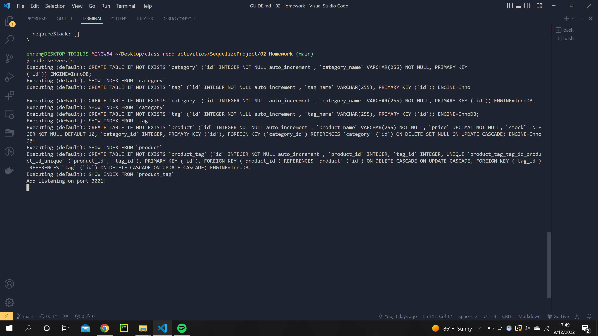
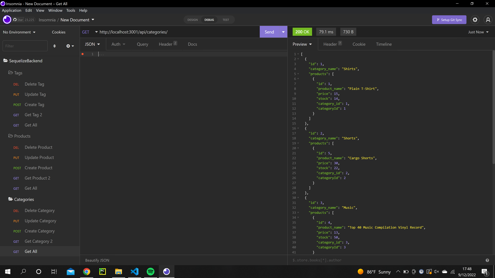
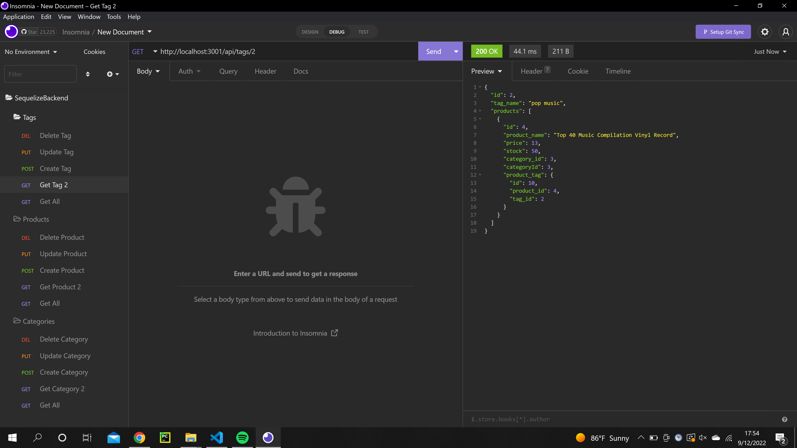

#  TrilogyEcommerceBackend

Author: Ehren Lewis

## Table Of Contents

* [About This Project](#about-this-project)
* [How to Install](#how-to-install)
* [Usage](#usage)
* [Known Issues](#known-issues)
* [Questions](#questions)
* [License](#license)
* [Contributing](#contributing)

## About This Project

 This application is a fully functional backend for an ecommerce site. It includes products, categories, and tags that a company can use later with a functioning frontend to havr a full stack ecommerce website

 My motivation behind this is as someone that wants to sell my own merchandise one day, it's very benficial to know how to handle database manipulation 
with requests, simulating how a real website would function when an item is purchased.

 The technologies I used were node, express, mysql2, sequelize, dotenv, and insomnia. I used node as a package manager, express for the server, mysql to house all of the databse information, sequelize to allow for easy communication with the databse, dotenv to protext sensitive information, and insomnia to the express route endpoints.

 Some of the challenges I faced during the creation of the project was to make sure data that has been properly formatted woul dbe sent through Insomnia. Missing information or improper information would cause an error to be sent back instead of the desired information.

 Future goals for this project include building a functional frontend, adding in a login system so users an ssee what they purchased, and improved error handling for bad requests.

## How to Install

    1. Navigate to the code repository
    2. Press the green code button, located near the about section
    3. Copy either the HTTPS, Git CLI, download the zip, open with GitHub desktop, or copy the SSH link.
    4. Depending on download method, use Git, executable, or the desktop application to open the content files.
    5. All of the content of the repository will be available after completion of the previous state.
    

## Usage

 To use this project, make sure all relative packages are installed with npm i. Once installed, make sure you seed the tables with npm run seed. Next, launch the server by running the server file. Next, navigate to insomnia and follow the paths that are set up in the file. Sending any request, GET, PUT, POST, and DELETE will be sent to the server and the desired output will be delivered.

link to demo: https://drive.google.com/file/d/19bDnMlUubmXzRx03LFqCowq8dDnfYFDa/view

## Known Issues

Currently, there isn't very much error handling on the route side so improper Insomnia requests may onlt deliver the desired information part of the time

## Questions

You can reach me at my Github: [Ehren-Lewis](https://github.com/Ehren-Lewis)

### OR

You can reach me at my [Ehren.Lewis@icloud.com](mailto:Ehren.Lewis@icloud.com) pertaining any other questions you may have

## License

MIT License

Copyright (c) 2022 [Ehren Lewis]

Permission is hereby granted, free of charge, to any person obtaining a copy
of this software and associated documentation files (the "Software"), to deal
in the Software without restriction, including without limitation the rights
to use, copy, modify, merge, publish, distribute, sublicense, and/or sell
copies of the Software, and to permit persons to whom the Software is
furnished to do so, subject to the following conditions:

The above copyright notice and this permission notice shall be included in all
copies or substantial portions of the Software.

THE SOFTWARE IS PROVIDED "AS IS", WITHOUT WARRANTY OF ANY KIND, EXPRESS OR
IMPLIED, INCLUDING BUT NOT LIMITED TO THE WARRANTIES OF MERCHANTABILITY,
FITNESS FOR A PARTICULAR PURPOSE AND NONINFRINGEMENT. IN NO EVENT SHALL THE
AUTHORS OR COPYRIGHT HOLDERS BE LIABLE FOR ANY CLAIM, DAMAGES OR OTHER
LIABILITY, WHETHER IN AN ACTION OF CONTRACT, TORT OR OTHERWISE, ARISING FROM,
OUT OF OR IN CONNECTION WITH THE SOFTWARE OR THE USE OR OTHER DEALINGS IN THE
SOFTWARE.

## Contributing

To contribute on this project, contact me through my Github or via email.
